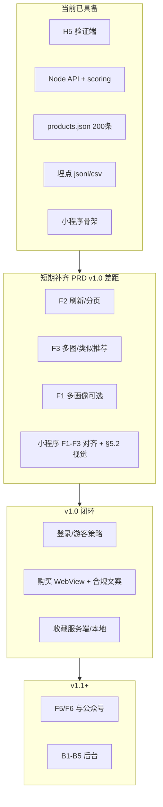

# 知礼 · 开发计划（PRD 与当前实现同步）

**整合排期与 develop1 勘误请以 [develop2.md](develop2.md) 为准**；本文保留 PRD 分项对照长表与阶段 A–E 详表。

本文档依据 [prd_v0.md](prd_v0.md) 通读结果，与仓库 **`prototype/`** 当前实现对齐后整理。**工程规格**：[prototype-spec.md](prototype-spec.md)；**验证流程**：[plan0.md](plan0.md)；**启动**：[prototype/README.md](prototype/README.md)。

---

## 一、PRD 与 `prototype` 实现对照（2026-05-02 同步）

**一行状态**：与仓库一致的快照见 [develop2.md](develop2.md) 篇首 **「当前开发状态」**；本节为 PRD 分项长表。

### 1.1 用户端小程序能力（PRD §3.1）— 以 H5 + 骨架为参照

| PRD | 要求摘要 | H5 `prototype/client` | 小程序 `prototype/mp-weixin` |
|-----|----------|----------------------|------------------------------|
| **F1** | 关系/年龄必填；兴趣≤3、禁忌可选；**多画像切换** | 单一路径画像；禁忌已支持；无多画像 | `profile` 简版；无多画像 |
| **F2** | 双列流；顶筛场合/预算/风格；**下拉刷新、上拉更多**；防抖 500ms；空状态+清空 | 双列✅；粘性筛选✅；防抖✅；**下拉刷新✅**；**触底加载更多✅**（`offset/limit`）；空状态 **SVG 插画✅** + 清空✅ | 双列+请求；筛选以页面为准；**无刷新/分页** |
| **F3** | 图轮播 **≥3**；理由 2–3 条；规格折叠；**横向类似推荐**；底栏收藏+去购买 | **多图轮播✅**（`images`≥3）；理由来自算法✅；**类似推荐横滑✅**（`/api/related`）；**无规格折叠**；底栏在抽屉内✅ | 详情占位为主 |
| **F4** | 收藏列表、送礼记录、左滑删除等 | 收藏仅 Toast + 埋点，**无列表/记录** | 未接 |
| **F5** | 订阅提醒、模板消息 | 无 | 无 |
| **F6** | 微信登录、个人中心、游客收藏 | 匿名 `zhili_vid`；**无登录/中心** | 未接登录 |

### 1.2 数据与算法（PRD §4）

| 条款 | 要求 | 当前实现 |
|------|------|----------|
| **4.1** | 画像标签体系 | `App.vue` 表单与 `personalized` body 对齐 |
| **4.2** | 商品三类标签 | `products.json` 含性别/年龄/兴趣/场合/风格/禁忌等 |
| **4.3** | 加权得分公式 | `prototype/server/scoring.js` |
| **4.4** | 理由模板 | `buildReasonLines` 与 PRD 因子对应 |
| **4.5** | 礼仪知识图谱、动机、情绪 | **未做**（路线图后续） |

### 1.3 交互与视觉（PRD §5）

| 条款 | 要求 | H5 验证端 |
|------|------|-----------|
| **5.1** | 骨架屏、Toast、Modal 等 | 骨架屏✅；Toast✅；详情为抽屉；**无分享 ActionSheet** |
| **5.2** | 小程序浅色规范 | 见 PRD 正文说明：H5 为**深色验证主题**；正式小程序须切回 §5.2 |

### 1.4 公众号 / 后台 / 商业化（PRD §3.2–3.3、§7–8）

| 模块 | 状态 |
|------|------|
| 公众号菜单、自动回复、模板消息、内容推送 | **未在仓库实现** |
| B1 看板、B2 标签管理、B3 推荐配置、B4 反馈、B5 AB 后台 | **未实现**；验证阶段仅有 `events.jsonl` + 导出 CSV + Python 分析 |
| 联盟 CPS、归因、订单核对 | **未接**；PRD §7 待 P2 后 |

### 1.5 路线图里程碑（PRD §10）与代码距离

| 版本 | PRD 核心 | 与当前差距摘要 |
|------|-----------|----------------|
| **v1.0** | 画像、推荐流、详情、收藏、跳转购买；指标：10 次真实购买 | 缺：小程序正式 UI、登录、**真实购买跳转与归因**、收藏持久化、F3 完整度 |
| **v1.1** | 订阅、送礼记录、数据看板；订阅用户≥500 | 全部待建 |
| **v1.2** | 商品池 500、负反馈、AB 框架；CTR≥15% | 商品可脚本扩容；负反馈与正式 AB 后台待建 |

---

## 二、目标结构：在验证与 MVP 之间的分层

---

## 三、分阶段开发计划（可排期）

### 阶段 A：H5 与数据「贴齐 PRD 表述」（约 3–5 人日）

**状态**：已在 `prototype/client` + `prototype/server` **落地**（v2.4 同步）；小程序仍按 B 阶段排期。

| 序号 | 任务 | PRD 锚点 | 验收 |
|------|------|-----------|------|
| A1 | 列表 **下拉刷新**、**触底加载**（`offset`/`limit`） | F2 | 刷新重拉；加载追加；`pull_refresh` 埋点 |
| A2 | 详情 **多图轮播**（`images[]` 由 API 生成） | F3 | ≥3 张可切换 |
| A3 | 详情 **横向类似推荐**（`GET /api/related/:id`） | F3 | 可点击切换详情 |
| A4 | 空状态 **SVG 插画** | F2 | 无结果时展示 |
| A5 | 商品池 **200 条** | 4.2 | `node scripts/generate-products.mjs 200` |

### 阶段 B：小程序 v1.0 核心（约 8–15 人日）

| 序号 | 任务 | PRD 锚点 | 验收 |
|------|------|-----------|------|
| B1 | **视觉规范 §5.2**（色板、间距、圆角、主按钮 48px） | §5.2 | 设计走查通过 |
| B2 | **F1** 与 H5 字段一致 + 可选 **多画像**（`wx.storage` 列表 + 当前 id） | F1 | 切换画像后列表刷新 |
| B3 | **F2** 双列 + 筛选防抖 + 刷新/分页（与 API 对齐） | F2 | 真机流畅 |
| B4 | **F3** 轮播、理由卡片、底部收藏+去购买；离开提示文案 | F3、9.1 | 合规文案可见 |
| B5 | **F6** 登录 + 游客；收藏写云端或本地策略 | F6 | 与 PRD 一致 |
| B6 | **`zhili_vid` + `/api/collect`** 全链路（与 H5 事件名对齐） | B1 漏斗 | 可导出分析 |

### 阶段 C：v1.0 购买与收藏闭环（约 5–8 人日）

| 序号 | 任务 | PRD 锚点 |
|------|------|-----------|
| C1 | 联盟转链占位 + WebView 打开 + **relationId/rid** 参数设计 | §7.2 |
| C2 | **收藏列表页**（双列）；登录同步服务端 schema 占位 | F4 |
| C3 | **「已购买」确认**（手动）+ 列表，防重复送礼 MVP | F4 |
| C4 | 小程序类目与 **外链域白名单**材料清单 | §9.2 |

### 阶段 D：v1.1（PRD M2）

- F5 订阅消息、模板与取消流程。  
- 送礼记录与后台 **B1 漏斗看板** 最小版（Metabase 或自建只读 SQL）。  
- 指标：订阅用户、漏斗与 PRD B1 字段对齐。

### 阶段 E：v1.2+（PRD M3 及以后）

- 商品池 500+、负反馈入口、正式 **B5** 实验配置；公众号 §3.2；增长 §8。

---

## 四、与 plan0 验证的关系

- **阶段 A 前部**可与「跑满实验样本」并行：不改 `group` 与打分，仅加刷新/分页时需注意埋点 `impression` 去重策略。  
- **阶段 B** 建议在 plan0 **结论通过**或「有条件通过」后全力投入，避免双线推翻交互。  
- 验收阈值仍以 [plan0.md](plan0.md) 为主；PRD §10 的「10 次真实购买」在 **阶段 C** 才有意义。

---

## 五、风险与依赖（摘自 PRD §9 + 实现体会）

- **联盟与类目**：晚接会拖 C1；尽早只读评审。  
- **多图与 CPS**：商品数据需 `images[]` 与 `affiliateUrl` 等扩展字段，建议在 `prototype-spec.md` 后续增补字段表。  
- **样本量**：与 [plan0.md](plan0.md) 实验设计一致，缩样本须在报告写清统计效力。

---

## 六、交付物与文档索引

| 产物 | 说明 |
|------|------|
| H5 + API | `prototype/` |
| 对照与计划 | **develop2.md**（整合主文档） / **develop.md**（§一、§三细表） |
| 接口与埋点 | [prototype-spec.md](prototype-spec.md) |
| Vue 入口 | [prototype-client-App-vue.md](prototype-client-App-vue.md) |
| 小程序 | [prototype/mp-weixin/README.md](prototype/mp-weixin/README.md) |
| PRD / 验证 | [prd_v0.md](prd_v0.md)、[plan0.md](plan0.md) |

---

## 七、历史说明

早期「PRD 与 plan0 对齐评估」计划中的 P0–P3 叙述已由 **`prototype` 落地** 部分替代；**以本文 §一、§三为最新排期**。若需追溯，可查 Cursor 计划《PRD 与 plan0 对齐评估》（`prd_与_plan0_对齐评估_484c98fd.plan.md`）。
