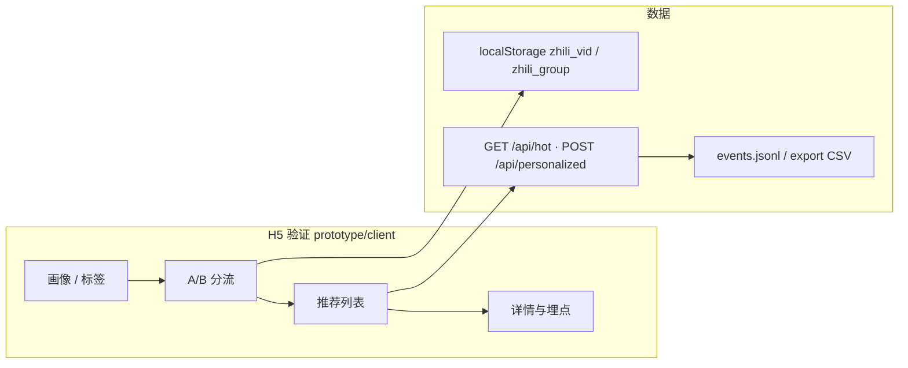

# 知礼 · 开发说明（PRD 与 plan0 对齐）

本文档由 Cursor 计划《PRD 与 plan0 对齐评估》（`prd_与_plan0_对齐评估_484c98fd.plan.md`）整理而成，并与当前仓库实现同步。**规格入口**：[prototype-spec.md](prototype-spec.md)；**启动**：[prototype/README.md](prototype/README.md)。

---

## 一、plan0 与 PRD 的对齐结论

[plan0.md](plan0.md) 与 [prd_v0.md](prd_v0.md) **第 10 节路线图 v1.0 之前** 的风险假设一致：在投入小程序全量、账号体系、电商 CPS 之前，先验证「**个性化推荐相对热门推荐的增量价值**」。

| 维度 | PRD 要求（与验证相关） | plan0 / 本仓库 |
|------|------------------------|------------------|
| 画像字段 | 关系、年龄段、兴趣≤3、禁忌可选；基础匹配含性别、预算、场合、风格 | `prototype` 表单与打分已对齐；禁忌见 PRD 4.3/4.4 |
| 推荐逻辑 | 加权得分 + 可解释理由模板 | `prototype/server/scoring.js`：`computeScore` + 理由模板 |
| 列表形态 | 双列、图/标题/价格/理由 | H5 与 plan0 一致 |
| 首页筛选条 | 场合/预算/风格 + 防抖 | H5 `browse` 已实现防抖筛选（验证「交互对 CTR」可用） |
| 商品规模 | MVP 约 200、需打标 | 默认约 120 条，可 `prototype` 内 `npm run gen:products` 扩至 80–200+ |
| 形态 | 小程序 + 公众号为核心 | 验证用 **H5 + 轻后端**；契约与后续小程序复用见 [prototype-spec.md](prototype-spec.md) |
| 合规 | 不采姓名电话等 | 页脚声明 + PRD 9.1 一致 |

**曾指出的缺口（仓库侧处理状态）**

1. **禁忌**：已纳入表单与 PRD 4.4 禁忌类理由逻辑（以 `scoring.js` 与 `App.vue` 为准）。
2. **推荐理由**：与得分 Top 因子绑定的模板句（非纯静态一句）。
3. **对照组 A**：热门接口为 **稳定 `hotRank` 排序**，非每次随机 shuffle。
4. **埋点**：含 `click`、`purchase_click` 等，便于漏斗分析；原始数据 `prototype/server/data/events.jsonl`。

**plan0 排期**：阶段表合计约 5–6 天（含招募），文末「2–3 天」偏乐观；**以阶段表为准**。

---

## 二、最小原型验证（数据流）

**技术栈（当前实现）**

- 前端：Vue 3 + Vite（`prototype/client`）。
- 后端：Node + Express（`prototype/server`），`GET /api/hot`、`POST /api/personalized`、`POST /api/collect`。
- 商品：`prototype/server/products.json`；埋点导出见 [prototype/README.md](prototype/README.md)。

**验收标准（是否通过验证）**

- 每组有效用户（提交画像 + 曝光≥10 商品）≥ **80**（与 plan0 一致；PRD 未写死数字）。
- B 相对 A 的 CTR：**p < 0.05**（卡方），或预先注册的更严指标。
- 问卷（可选）：理由合理性均分 ≥ 3.5 作为辅证。

---

## 三、验证通过后的阶段计划（衔接 PRD v1.0）

以下阶段编号与评估计划一致；**P0 大量工作已在当前 `prototype` 中落地**，后续以「增强 / 迁移小程序」为主。

### 阶段 P0：算法与数据契约冻结（约 3–7 天）

| 项 | 状态 / 说明 |
|----|-------------|
| PRD 4.3 / 4.4 单一模块 | 已实现于 `scoring.js`；若抽成 npm 包或与云函数共用，可再拆 |
| `products.json` 规模与字段 | 持续对齐 PRD 4.1–4.2；建议维持 **≥80**，目标 **~200** |
| 单元测试 | 可选：给定画像向量，断言得分与理由因子与手工表一致 |

### 阶段 P1：微信小程序 v1.0 核心（约 5–10 天）

- 选型：uni-app 或原生（PRD §6）。
- 账号：**微信登录 + 游客本地收藏**（PRD F6）。
- 页面：**F1** 画像创建/编辑、**F2** 双列流 + 筛选条 + 防抖、**F3** 详情多图轮播与理由卡片（当前骨架见 [prototype/mp-weixin/README.md](prototype/mp-weixin/README.md)）。
- 推荐：前端或云函数调同一套 API；权重占位对应 PRD B3。

### 阶段 P2：收藏与购买跳转（约 3–5 天）

- 收藏：登录走服务端；游客仅本地（PRD）。
- 「去购买」：WebView + 离开提示（PRD 9.1）；联盟 PID/relationId（PRD 7.2）可先占位，密钥与审核后置。

### 阶段 P3：埋点与看板雏形（可与运营并行）

- 事件对齐 PRD B1 漏斗；导出至 Metabase / 简表或自建 B1。

**刻意延后（PRD v1.1+）**：订阅消息（F5）、送礼记录完整闭环、公众号全量、后台 B2–B5 全量。

---

## 四、风险与依赖

- **联盟资质与小程序类目**（PRD 9.2）：跳转购买尽早确认类目与外链域白名单。
- **验证样本**：计划 200 人；若缩至每组约 50，显著性效力下降，**须在实验报告中写明局限性**。

---

## 五、交付物清单

| 产物 | 说明 |
|------|------|
| 可部署 H5 + 轻量 API | 本仓库 `prototype/`；启动见 [prototype/README.md](prototype/README.md) |
| `products.json` + 打标说明 | 与 PRD 4.1–4.2 对齐；生成脚本 `prototype/scripts/` |
| `computeScore` + 理由生成 | `prototype/server/scoring.js` |
| 埋点原始数据 + 分析脚本 | `events.jsonl`；Python 见 `prototype/analysis/`、[plan0.md](plan0.md) |
| 实验报告（Markdown/PDF） | 结论、是否进入 P1、参数调整建议 |
| 开发规格与小程序说明 | [prototype-spec.md](prototype-spec.md)、[prototype-client-App-vue.md](prototype-client-App-vue.md)、[prototype/mp-weixin/README.md](prototype/mp-weixin/README.md) |

---

## 六、文档索引

| 文档 | 用途 |
|------|------|
| [prd_v0.md](prd_v0.md) | 产品需求全文 |
| [plan0.md](plan0.md) | 最小验证流程与指标 |
| [prototype-spec.md](prototype-spec.md) | 工程与 API、埋点、页面阶段 |
| [develop.md](develop.md) | 本文：对齐结论与分阶段开发路线 |
