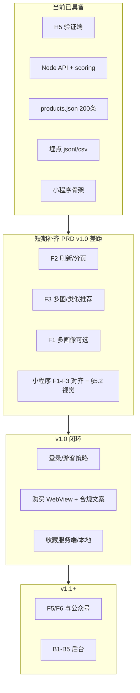

# 知礼 · 整合开发计划（develop2）

**版本**：v3.0  
**更新**：2026-05-04（**B4** **`GET /api/recommend`** + **`lib/recommendCache.js`** + 画像写后 **`DEL`**；**B3** **`recommendCore`**；[api.md](api.md) **§4.2.2**；**§9.5.0** 落地快照）  
**状态**：待评审（仓库 **B0 + B1 + B2 + B3 + B4（主路径）+ 本机 Docker** 与篇首快照、[prototype-spec.md](prototype-spec.md) §3、[api.md](api.md) 一致）  

本文档由原 **develop1**（MVP 规格 / SQL / 人天）与 **develop.md**（PRD 分项与 H5 阶段 A–E）整合重写，并与仓库 **`prototype/`**、[prototype-spec.md](prototype-spec.md)、[api.md](api.md)、[plan0.md](plan0.md)、[prd_v0.md](prd_v0.md) 对齐。**PRD 与 H5 分项长表**见本文 **附录 A**；原独立文件已删除，需追溯可查 Git 历史。

---

## 当前开发状态（仓库快照 · 与代码同步）

> 以下与 `prototype/` 当前提交一致；**未在仓库内自动探测**的项（如是否已跑满实验、是否已出报告）标为 **外部依赖**。

| 域 | 状态 | 说明 |
|----|------|------|
| **H5 验证端** | **已具备** | `prototype/client`：`landing` → `tags` → `browse`；双列推荐；场合/预算/风格筛选 **500ms 防抖**；**下拉刷新**（触顶下拉 + `pull_refresh` 埋点）、**触底加载更多**；骨架屏、Toast、详情抽屉；**空状态 SVG 插画**；A/B、`zhili_vid` / `zhili_group` / `zhili_profile` |
| **API** | **已具备** | 验证流：`GET /api/hot`、`POST /api/personalized`、**`GET /api/related/:id`**、`POST /api/collect`、`GET /api/export/events.csv`、`GET /api/health`；**B1**：`POST /api/user/login`、`GET /api/user/me`；**B2**：**`/api/profile*`**（**Bearer**）；**B3**：**`GET /api/user/recommend`**；**B4**：**`GET /api/recommend`**（**`page`/`size`** + **Redis** 可降级，**Bearer**）；`/api/health` 含 `auth_configured`、`jwt_strong_secret`；契约见 [api.md](api.md) **§2、§4.2.1、§4.2.2、§4.3、§10**；B2 自测见本文 **§9.3.4** |
| **算法与数据** | **已具备** | `scoring.js` 对齐 PRD 4.3/4.4；**`products.json` 共 200 条** |
| **埋点落盘** | **已具备** | `prototype/server/data/events.jsonl`（无事件时目录或文件可能尚未生成，属正常） |
| **小程序骨架** | **已具备** | `prototype/mp-weixin`：`profile` → `index` → `detail`；`app.json` 导航栏已用 PRD §5.2 主色占位 |
| **阶段 A（H5）** | **已在 H5 落地** | 下拉刷新、触底分页、详情多图轮播、详情内横向类似推荐、空状态插画、商品池 **200**；小程序端仍待对齐（排期见附录 A §三） |
| **MVP 后端（B0～）** | **B0+B1+B2+B3+B4（主路径）已具备** | **B0** 同前。**B1** 同前。**B2** 同前。**B3**（**§9.4.0**）。**B4**：**`routes/recommend.js`**、**`lib/recommendCache.js`**、**`GET /api/recommend`**；**B2 写画像后** **`invalidateUserRecommendations`**；**B4 余量**：**B4.8～B4.9** 限流/观测、**B4.11** 压测报告，见 **§9.5.0**。**B5+**：`/api/product/:id`、`/api/favorite*`、联盟转链等仍待开发 |
| **本机 Docker（B0 配套）** | **已具备** | `prototype/docker-compose.yml`（MySQL 8、Redis 7）；`npm run dev:db`（起容器 + 等健康 + `migrate`/`seed`）；`npm run docker:mysql-fresh`（改 root 密码后需重建卷时 `down -v`）；`server/.env.docker.example`；排错与 WSL/镜像加速见 [prototype/README.md](prototype/README.md)「本机 Docker」 |
| **实验与决策门** | **外部依赖** | 部署、招募、样本量、CTR 报告是否完成：**以团队实际为准**；门槛仍按 §3 |

**本地运行**：[prototype/README.md](prototype/README.md)（先 `server` 再 `client`；**若用 Docker MySQL/Redis**，先在该 README 完成 compose 与 `npm run dev:db`，保证 `server/.env` 中 **`DB_PASSWORD` 与 `MYSQL_ROOT_PASSWORD` 一致**；改密后旧卷需 `docker:mysql-fresh` 或手动 `ALTER USER`）。

**下一增量（与 §9.1 顺序一致）**：（**B9** 商品写接口可部分并行）→ **B3/B4 收尾**（§9.4.0、§9.5.0 余量）→ **B5**～**B8** → **B10** 联调硬化。（**B1～B4 主链已落地**。）

---

## 0. 文档关系

| 文档 | 用途 |
|------|------|
| **develop2.md（本文）** | 整合：验证门 + MVP 全量结构（范围/技术/库表/API/任务/验收/灰度/风险）+ `prototype` 勘误与映射；**附录 A** 为 PRD 分项与阶段 A–E |
| [api.md](api.md) | `prototype/server` HTTP 接口说明；**B2** **§4.3**；**B3** **§4.2.1**；**B4** **`GET /api/recommend`** **§4.2.2**；Redis 约定 **§8.3**；Postman **§10** |
| [prototype-spec.md](prototype-spec.md) | 当前验证端工程与埋点事实 |

> 原 `develop.md`、`develop1.md` 已废止；SQL 与迁移以 **`prototype/server/migrations/*.sql`** 与本文 **§6** 为准，需追溯全文可查 Git 历史。

---

## 1. develop1 与当前仓库（prototype）勘误

| develop1 表述 | 仓库事实 |
|---------------|----------|
| 前端 Vue3 CDN + Vant，部署 Vercel/Netlify | **Vue 3 + Vite**，`prototype/client`；本地/自建部署为主 |
| A 组「随机排序」/ 随机 | **`GET /api/hot` 按 `hotRank` 稳定排序** |
| B 组「前端打分」 | **`prototype/server/scoring.js`** + **`POST /api/personalized`** |
| sendBeacon / Google 表单 | **`fetch` → `POST /api/collect`** → `server/data/events.jsonl` |
| 匿名 `user_id` | **`zhili_vid`**；分组 **`zhili_group`**；画像 **`zhili_profile`** |
| 埋点事件 6 类 | 另含 **`explore_click`**；字段名见 prototype-spec §5 |
| 后端 Nest.js + TS | 验证端为 **Express + JS**；MVP 可按 develop1 升级为 Nest |
| `user_profile.budget_max` decimal | 验证端为 **预算档位枚举**（如 `100-300`），与 PRD / `personalized` body 一致 |
| `relation` 等中文 enum | `products.json` / API 使用 **英文 key**（如 `friend`），上线迁移需对照表 |
| 验证「2–3 天」总成本 | develop1 §0.2 阶段表含 **招募 2–3 天**；总周期以 **表内合计** 为准，勿压缩样本 |

---

## 2. 能力与缺口明细（对照 §「当前开发状态」）

| 模块 | 已实现 | 仍为缺口 |
|------|--------|----------|
| H5 | 同快照表 | 多画像、微信登录、收藏列表持久化 |
| API | 同快照表 | develop1 风格登录/画像/收藏/转链 REST |
| 数据 | **200** 条商品 JSON；API 返回 `images[]`；**Docker 下可** `seed` 落 **`product` 表**与库表结构对齐 | 联盟字段、运营后台；**线上**仍以 develop1 数据层为准 |
| 小程序 | 三页 + PRD 色顶栏 | WeUI 全量、登录、与 H5 同等交互、埋点全量 |
| 后台 / 联盟 | — | develop1 §3.2、CPS；**本机** MySQL/Redis 已由 Docker 编排覆盖，**不等同**生产托管与联盟 |

---

## 3. 前置验证（develop1 §0 + plan0 门控）

### 3.1 目的与决策门

- **目的**：最小成本验证「个性化是否显著优于热门」。  
- **develop1 通过条件**：B 组 CTR > A 组且相对提升 **≥10%**，**p < 0.05**；理由评分 **≥4 分占比 >70%**。  
- **plan0 主门槛**（不替代 develop1 的 p 值，样本与卡方以 plan0 为准）：有效用户每组 **≥80**；B vs A CTR **p < 0.05**；可选问卷 **≥3.5**。  
- **结论**：未通过则调算法/交互后复验，**不启动** develop1 第 1 章起完整 MVP 排期。

### 3.2 阶段与时间（develop1 §0.2）

| 阶段 | 时间 | 产出 | 负责人 |
|------|------|------|--------|
| 准备（原型/埋点/分流） | 0.5 天 | 原型、埋点方案 | 产品+前端 |
| 前端页面开发 | 1.5 天 | 可运行 H5（画像+流+埋点） | 前端 |
| 轻量后端 | 0.5 天 | Node API | 后端 |
| 用户招募与实验 | 2–3 天 | ≥200 行为样本 | 运营+产品 |
| 数据分析与报告 | 0.5 天 | 实验报告 + 显著性检验 | 数据分析 |

### 3.3 验证期技术事实（替换 develop1 §0.3 中过时句）

- 前端：**Vue 3 + Vite** + `fetch`；存储 **`zhili_*`**。  
- 分流：首次随机 A/B，写入 **`zhili_group`**。  
- 商品：**`products.json`**（50–200 条策略仍适用）。  
- 埋点：**§1** 已述。  
- 分析：Python 脚本见 `prototype/analysis` 与 plan0。

---

## 4. 项目范围（develop1 §1）

### 4.1 核心目标

微信小程序闭环：**创建收礼人画像 → 个性化推荐 → 收藏 → 跳转购买**（前提：前置验证通过）。

### 4.2 v1.0 包含 / 不包含

**包含**：微信授权登录（含静默 openId）、画像创建与管理（**多画像** develop1 标为能力目标）、双列推荐 + 顶筛、详情（轮播+理由）、收藏云端、联盟购买跳转、基础埋点。

**不包含（后续迭代）**：订阅提醒、送礼记录、AB 平台、负反馈、分享裂变、自营/会员（与 develop1 §1.2 一致）。

### 4.3 功能清单与优先级（develop1 §3）

**小程序（§3.1）**：登录 P0；画像创建 P0；**多画像管理 P1**；推荐首页 P0；详情 P0；收藏 P0；购买跳转 P0；我的 P0。

**极简后台（§3.2）**：商品 CRUD + 标签 P0；数据看板 P1；画像匿名统计 P1。

---

## 5. 技术选型（develop1 §2 + 验证期对照）

| 层 | develop1（MVP 目标） | 当前验证端 |
|----|----------------------|-------------|
| 小程序 | 原生 + WeUI | `mp-weixin` 骨架 |
| 后端 | Node **Nest.js** + TypeScript | **Express** + JS |
| 数据 | MySQL 8 + Redis 7 | **JSON 文件 + JSONL** |
| 电商 | 京东联盟主、淘宝备用 | 未接 |
| 部署 | 腾讯云 CVM + CDN | 本地 / 任意 Node 托管 |
| 埋点 | 自定义 + 微信分析 | **自建 collect** |

---

## 6. develop1 MVP 后端 — 数据库与字段对齐

建表 **以仓库 `prototype/server/migrations/*.sql` 与 PRD 为准**（历史规格曾独立成 develop1 §4）；以下为 **与 `prototype` 落地数据** 的映射与落库注意，避免直接拷 SQL 而不改类型。

### 6.1 表级映射

| develop1 表 | prototype 现状 | MVP 落库说明 |
|---------------|------------------|--------------|
| `user` | 匿名 `zhili_vid`（字符串） | 微信登录后写入 `openid`；可保留 `device_id`/`anon_id`  varchar 关联历史埋点 |
| `user_profile` | 浏览器单次画像 JSON；服务端表见 **`migrations/001`+`002`** | 列 **`age_band`、`interests` JSON、`occasion`、`style`、`taboos`** 与 **`POST /api/personalized` / `scoring.js`** 一致（**策略 A**，§9.3.1）；**B2** **`/api/profile*`** 已实现 |
| `product` | `products.json` 行 | `id`→`product_id`；`title`→`name`；**`styles` 数组**→develop1 单 `style` enum：取主风格或拆成 `styles` json 改表 |
| `collection` | 无持久化 | 新表 + `POST/DELETE /api/favorite*`（见 §7） |
| `event` | `events.jsonl` 多字段 JSON | `event_type` ← `event`；`extra` ← 其余字段 JSON；`user_id` 登录后 FK，未登录可写 0 + `extra.zhili_vid` |

### 6.2 枚举与中英文（develop1 SQL ↔ API）

| develop1 / SQL 写法 | prototype / `personalized` body | 迁移策略 |
|---------------------|-----------------------------------|----------|
| `relation` 中文 enum | `relation`: `friend` / `partner` / … | 小程序或 ETL **对照表**双向转换 |
| `age_range` `<18` 与 `18-25` | `under18`、`18-25` | 行级映射；勿混用 |
| `circles` json（历史 develop1） | `interests: string[]` | **`user_profile` 库列名为 `interests`**（新装 001；旧库由 **002** 自 `circles` 重命名） |
| `budget_max` decimal | `budget`: `100-300` 等档位 | 二选一：**档位列**（与现算法一致）或 **max 元** + 网关换算入 `personalized` |
| `gender` 男/女/通用 | `male` / `female` / `unknown` | 对照表 |
| `product.style` 单枚举 | `styles[]` | 入库时写主风格；或改 product 为 `styles` json（推荐与 PRD 4.2 一致） |

### 6.3 `product` 与 `products.json` 字段对照

| develop1 `product` | `products.json` |
|--------------------|-----------------|
| `product_id` | `id` |
| `name` | `title` |
| `selling_point` | `sellPoint` |
| `occasion_keyword` | `occasionKeyword` |
| `images` json | 验证端 API 已返回 **`images`**；落库可原样存 |
| `click_count` | 暂无 | MVP 可由埋点聚合或异步任务更新 |

---

## 7. develop1 API 与验证端网关对齐

### 7.1 路径冲突（强制约定）

| 路径 | develop1 原意 | `prototype/server` 实际 | MVP 约定 |
|------|---------------|---------------------------|----------|
| **`POST /api/collect`** | develop1 曾列为「添加收藏」 | **仅埋点**，JSON 与 [prototype-spec.md](prototype-spec.md) §5 | **埋点独占此路径**；业务收藏改用 **`/api/favorite`**（develop1 已改为该名，见 develop1 §5 修订） |

### 7.2 端点对照与实现方式

| develop1 端点 | 说明 | 与 prototype 对齐方式 |
|---------------|------|----------------------|
| `POST /api/user/login` | `code` → `openid` | 新写；与推荐网关同服务或同域 |
| `POST /api/profile` 等画像 CRUD | 持久化多画像 | Body 字段与 **`personalized` 画像段** 同名（英文键），便于复用 `scoring.js` |
| `GET /api/recommend` | `page`、`size` | **`offset=(page-1)*size`，`limit=size`**；网关按 `user`+`zhili_group` 或业务规则选 **`GET /api/hot`** 或 **`POST /api/personalized`** |
| `GET /api/product/:id` | 详情 | 可从 MySQL 读；或代理读静态 JSON + **与 `/api/related/:id` 同包部署** |
| `POST/DELETE /api/favorite`、`GET /api/favorite/list` | 收藏 | **新实现**；与埋点分离 |
| `POST /api/event` | 结构化事件表写入 | **可选**：与 `POST /api/collect` 二选一或双写（collect 兼容验证脚本） |
| `GET /api/purchase/url` | 联盟转链 | 新写；`product` 表增 `affiliate_url` / PID 字段 |

### 7.3 推荐内核复用（不必重写打分）

网关层只负责：**鉴权** → **取当前 `profile_id` 与 shelf** → 调内部 **`/api/hot` 或 `/api/personalized`**（已实现分页、筛选、`images`、`/api/related`）→ 映射响应字段名（若小程序协议固定）。

**B3（推荐内核对接）** 把上述「取画像 + 调内核」在工程上 **落地为可复用模块/包/内部 HTTP**（不重写 `scoring.js`），目的、边界与子任务见 **§9.4**。

**B4（推荐网关 + Redis）** 对外暴露 **`GET /api/recommend`** 并挂 **§8.3** 缓存与失效，目的与子任务见 **§9.5**。

---

## 8. 推荐算法、理由与缓存（develop1 §6）

| develop1 条款 | 对齐说明 |
|-----------------|----------|
| **§6.1 得分子项** | 与 PRD 4.3 及 **`prototype/server/scoring.js`** 一致；MVP **移植 `computeScore`** 到 Nest 服务或 **子进程调用现模块**，避免两套公式 |
| **§6.2 理由 copy** | develop1 示例为简版；线上以 **`buildReasonLines`**（PRD 4.4，含禁忌）为准，develop1 文案表可作运营参考 |
| **§6.3 Redis** | Key：`recommend:{user_id}:{profile_id}:{filter_hash}`，`filter_hash` = 稳定序列化 `occasion|budget|style|group`（如 SHA256 前 12 位）；**TTL 600s**；**画像变更** `DEL recommend:{user_id}:*`；故障 **降级**：与 develop1 一致走 **`hotRank` 或 `click_count` 排序**（验证端热门逻辑已存在） |

**prototype**：未起 Docker 时 **无 Redis 进程**（`db.js` 降级）；`prototype/docker-compose.yml` 可提供 **Redis 7** 供本机/B4 预演。无 `click_count` 实时写回，MVP 接上 `event` 表后可批处理更新 `product.click_count`。

**B4 落地时**：以上 key/TTL/失效/降级须与 **§9.5** 子任务 **B4.3～B4.7** 写进实现与单测，避免与 **§9.5.2** 边界冲突。

---

## 9. 开发任务分解（develop1 §7）

**前提**：验证通过且商品打标完成。develop1 表内人天合计 **38**（后端 14 + 前端 16 + 后台 4 + 测试部署 4）；日历仍可按 **约 4 周、2 人并行** 排期。

### 9.1 MVP 后端任务分解（WBS，与 §6～§8 对齐）

以下按 **可并行边界** 与 **依赖顺序** 拆项；人天仍汇总为下表 **14**（若 **`scoring.js` 整包复用** 且不做 Nest 内重写，可将「推荐打分」人天挪到联调/网关映射）。

| 序号  | 任务包              | 内容要点                                                                                                                                                                                                                                                     | 依赖           | 交付物                                                                                                                                                                    |
| --- | ---------------- | -------------------------------------------------------------------------------------------------------------------------------------------------------------------------------------------------------------------------------------------------------- | ------------ | ---------------------------------------------------------------------------------------------------------------------------------------------------------------------- |
| B0  | **工程与数据基座**      | Nest（或沿用 **Express 单体**，**当前仓库为后者**）；MySQL 连接池；迁移脚本；**§6 建表**（`user` / `user_profile` 含 `taboos` / `product` / `collection` / `event`）；**`products.json` → `product` 初始化**（字段对照 §6.3）；本地/测试 Redis（**`prototype/docker-compose.yml` + `npm run dev:db`**） | —            | 可执行迁移、种子数据、健康检查；**交付物路径**：`server/migrations/`、`server/migrate.js`、`server/seed.js`、`server/db.js`、`prototype/README.md`（Docker）、`prototype/scripts/docker-dev-up.mjs` |
| B1  | **微信登录**         | `POST /api/user/login`：`code`2Session → `openid` 落 `user`；JWT 或 session；与小程序 `app.login` 约定                                                                                                                                                              | B0           | **已实现（Express）**：`POST /api/user/login`、`GET /api/user/me`、`lib/jwt.js`、`middleware/requireAuth.js`；详见 [prototype/README.md](prototype/README.md)「B1」                  |
| B2  | **画像 CRUD**      | 持久化 **`user_profile`**；REST **与 `POST /api/personalized` 画像段英文键一致**（§7.2、§9.3）；鉴权 **`requireAuth`**；默认画像与列表分页；详见 **§9.3**                                                                                                                                | B1           | **`routes/profile.js`**、**`lib/profileSchema.js`**、**`profile.test.mjs`**；**`002`+`migrate.js`**；契约见 [api.md](api.md)                                                                                                                               |
| B3  | **推荐内核对接**       | **目的**：登录后推荐以 **B2 默认画像** 为输入，与 **`POST /api/personalized`**、**`scoring.js`** 同源、不漂移。**边界**：**不**实现对外 **`GET /api/recommend`**、**不上 Redis**（**B4**）。详见 **§9.4**                                                                                             | B0、B1、B2 | **主路径已实现**：**`lib/recommendCore.js`**、**`productsData.js`**、**`GET /api/user/recommend`**（[api.md](api.md) §4.2.1）；**`index.js`** 已切至 **`recommendCore`**。**余量**见 **§9.4.0**                                                                                                                                                         |
| B4  | **推荐网关 + Redis** | **目的**：对外 **`GET /api/recommend`**；**B3 内核**之上 **分页**、**Redis**、**失效**、**降级**；可选限流/观测见 **§9.5.0 余量**。**边界**：**不**改写 **`scoring.js`**。详见 **§9.5**                                                                                                                                                            | B3、B0、B1 | **主路径已实现**：**`routes/recommend.js`**、**`lib/recommendCache.js`**、**`recommend.test.mjs`**；**`profile.js`** 写后 **`DEL`**；契约 [api.md](api.md) **§4.2.2**。**余量**见 **§9.5.0**                                                                                                                                                               |
| B5  | **商品读模型**        | `GET /api/product/:id`；可选代理 **`/api/related/:id`**；与小程序详情协议对齐                                                                                                                                                                                            | B0           | 详情 JSON 含 `images`、理由字段                                                                                                                                                |
| B6  | **收藏（业务）**       | **`POST/DELETE /api/favorite`、`GET /api/favorite/list`**；表 `collection`；**禁止占用 `POST /api/collect`**（§7.1）                                                                                                                                               | B1           | 收藏幂等与列表分页                                                                                                                                                              |
| B7  | **埋点入库（可选）**     | `POST /api/event` 写 `event`；或与验证端 **`POST /api/collect` 双写**、网关转发；匿名 `zhili_vid` 进 `extra`（§6.1）                                                                                                                                                         | B0、B1（可选）    | 与 CSV/分析脚本字段可对齐                                                                                                                                                        |
| B8  | **联盟转链**         | `GET /api/purchase/url`；`product` 联盟字段；超时重试≤2、结果缓存（§13）                                                                                                                                                                                                  | B0           | 可跳转真实/沙箱链接                                                                                                                                                             |
| B9  | **商品写接口（极简后台）**  | develop1 后台依赖的 **商品 CRUD API**；权限与运营账号（可与 B1 分角色）                                                                                                                                                                                                        | B0、B1        | 后台可录入/改价签                                                                                                                                                              |
| B10 | **联调与硬化**        | 与小程序端对 **鉴权头、错误码、分页、空列表**；压测推荐 P90；Redis 降级演练                                                                                                                                                                                                            | B1～B9 主链     | 联调清单关闭、§11.2 后端相关项达标                                                                                                                                                   |

### 9.2 B1 微信登录（细化 WBS）

> develop1 对应：**用户登录（微信）** 约 **1 人天**；下表按 **0.2～0.3 人日粒度** 拆便于排期与验收，可与 **小程序 `wx.login` + 首屏** 并行对齐。

| 子项 | 任务 | 要点与验收 | 依赖 |
|------|------|------------|------|
| **B1.1** | **密钥与运行配置** | 环境变量 **`WECHAT_APPID`**、**`WECHAT_SECRET`**（或密钥托管），**不入库、不进 Git**；`.env.example` 仅保留占位名。可选 **`JWT_SECRET`** / **`JWT_EXPIRES_IN`**（如 `7d`）。验收：`grep` 仓库无真实 secret。 | B0 |
| **B1.2** | **`jscode2session` 对接** | `POST /api/user/login` 收到 **`{ "code": "<wx.login 临时码>" }`** 后，服务端请求 `https://api.weixin.qq.com/sns/jscode2session`（`appid`、`secret`、`js_code`、`grant_type=authorization_code`）。解析 **`openid`**，可选 **`unionid`**；处理微信错误码（如 `40029` code 无效、`45011` 频率限制）并映射为 **稳定 HTTP 状态 + 业务错误码**（勿把微信原文直接暴露给前端）。**不把 `session_key` 写入日志或响应体**。 | B1.1 |
| **B1.3** | **`user` 表 upsert** | 以 **`openid` 唯一** upsert：`INSERT ... ON DUPLICATE KEY UPDATE updated_at=NOW()`（或先查后插）。新用户得 **`user.id`**；与 develop2 §6.1 对齐：请求体可选带 **`anon_id`/`zhili_vid`** 时，**同事务**写入 `user.anon_id`（若列仍空）以便与历史埋点关联。验收：同一 `openid` 重复登录 **不产生重复行**。 | B1.2、B0 表 |
| **B1.4** | **会话签发（JWT 推荐）** | 签发 **JWT**：`sub`=`user.id`（数字或字符串与客户端约定一致），`iat`/`exp`，可选 claim `openid`。响应体建议：`{ "token", "expires_in", "user": { "id", "openid" } }`（字段名与 **小程序存储键** 在接口文档中写死）。**备选**：服务端 Session + Redis + `Set-Cookie`（小程序侧多使用 **Bearer**，优先 JWT）。验收：`jwt.io` 或单测解码 claims 正确。 | B1.3 |
| **B1.5** | **鉴权中间件** | 抽取 **`requireAuth`**：从 **`Authorization: Bearer <token>`** 解析 JWT，失败返回 **401**；将 **`req.userId`**（及可选 `openid`）注入后续路由。**B6/B9 等写操作**必须挂此中间件；**B2 画像**按 `user_id` 隔离。验收：无 token 调受保护路由 **401**；伪造 token **401**。 | B1.4 |
| **B1.6** | **限流与防滥用** | 对 **`/api/user/login`** 按 **IP + code 指纹** 简单限流（如内存计数或 Redis 计数），防止刷 code、刷 token。验收：压测或脚本连续请求触发 **429** 或统一错误码。 | B1.2（Redis 可选 B0） |
| **B1.7** | **小程序联调约定** | 与 **`prototype/mp-weixin`**（或正式小程序仓库）对齐：**`wx.login` → `code` → POST 本接口 → 存 `token`**；后续请求带 **Header**。文档：**请求/响应示例、错误码表、HTTPS 仅生产强制**。验收：开发版真机或开发者工具走通 **登录 → 带 token 调任意占位受保护接口**。 | B1.4～B1.5 |
| **B1.8** | **测试与可观测** | **单元测试**：mock `jscode2session` HTTP，覆盖成功 / 无效 code / 微信侧 5xx。**集成测试**（可选）：测试号 + 真 `code`。`/api/health` 可增加 **`auth_configured`**（布尔，不泄露 secret）。验收：`npm test` 或 CI 绿灯。 | B1.2～B1.5 |

### 9.3 B2 画像 CRUD（细化 WBS）

> **人天参照**：develop2 人天表「画像 CRUD API」约 **2 人日**；下表按 **0.25～0.5 人日** 粒度拆，便于并行（**契约与迁移** ∥ **路由实现**）与验收。

#### 9.3.1 现状（实施约定）

| 项 | 说明 |
|----|------|
| **表与列（策略 A 已选）** | **新装**：`001_b0_schema.sql` 中 **`user_profile`** 已含 **`age_band`、`interests` JSON、`occasion`、`style`**，与 **`personalized` / `scoring.js`** 语义一致。**旧库**：`npm run migrate` 在检测到仍存在 **`age_range`** 时自动执行 **`002_user_profile_scoring_align.sql`**（`age_range`→`age_band`、`circles`→`interests`，并 **`ADD occasion`、`style`**）。实现见 **`prototype/server/migrate.js`**。 |
| **B2 路由** | **`/api/profile*`** 已在 **`routes/profile.js`** 挂载；落库使用 **与 API 相同的英文键名**（`lib/profileSchema.js` 校验与序列化）。 |
| **列表分页 SQL** | **`GET /api/profile`** 的 `offset`/`limit` 经 **`parsePaging`** 约束（`limit` 默认 20、最大 50；`offset`≥0）后，**`LIMIT`/`OFFSET` 以整数拼入 SQL**，**不使用** `LIMIT ? OFFSET ?` 预编译占位——否则部分 MySQL 会报 **`Incorrect arguments to mysqld_stmt_execute`**。详表与错误码见 [api.md](api.md) **§4.3**。 |
| **鉴权** | 所有画像写读必须 **`Authorization: Bearer`** + **`requireAuth`**，`user_id` **仅来自 JWT `sub`**，**禁止**信任 Body 里的 `user_id` |

#### 9.3.2 子任务与验收

| 子项        | 任务                                          | 要点与验收                                                                                                                                                                                                                                                                                                         | 依赖        |
| --------- | ------------------------------------------- | ------------------------------------------------------------------------------------------------------------------------------------------------------------------------------------------------------------------------------------------------------------------------------------------------------------- | --------- |
| **B2.1**  | **契约冻结**                                    | 在 **`api.md`**（或 OpenAPI 片段）写明：**请求/响应 JSON 与 `POST /api/personalized` 画像段一致**——字段：`relation`、`ageBand`、`interests`（数组 ≤3）、`occasion`、`budget`、`gender`、`style`、`taboos`（数组）；可选 `name`（展示名，映射库 `user_profile.name`）。**枚举合法值**与 `prototype/client` 表单、`scoring.js` 常量一致（§6.2）。验收：评审签字或 PR 内联表格无 open question。 | B1        |
| **B2.2**  | **迁移 / 映射落地**                               | **策略 A 已完成**：`002` + `migrate.js` 条件执行。验收：旧库 `npm run migrate` 后列名对齐。                                                                                                                        | B2.1、B0   |
| **B2.3**  | **`POST /api/profile` 创建**                  | **已实现**：校验 + 首条强制默认 + `is_default` 互斥。                                                                                                                                                  | B2.2、B1.5 |
| **B2.4**  | **`GET /api/profile` 列表**                   | **已实现**：`{ list, total }`；Query **`offset`/`limit`**（语义与 hot/personalized 分页一致，见 [api.md](api.md) §5.1）；分页 SQL 约定见 **§9.3.1**。                                                                                              | B2.3      |
| **B2.5**  | **`GET /api/profile/:id` 详情**               | **已实现**：非本人 **404**。                                                                                                                                                                                               | B2.3      |
| **B2.6**  | **`PUT /api/profile/:id` 更新**               | **已实现**：全量更新；唯一默认画像不可先取消默认（需先设他条默认）。                                                                                                                                                                                                              | B2.5      |
| **B2.7**  | **`DELETE /api/profile/:id`（可选）**           | **已实现**：删默认后自动升一条为默认；仅剩一条 **409**。                                                                                                                                                                                                         | B2.5      |
| **B2.8**  | **`PUT /api/profile/:id/default`（或 PATCH）** | **已实现**：`PUT .../:id/default`。                                                                                                                                                                                                                                                          | B2.5      |
| **B2.9**  | **与推荐链路的接口**                                | **`GET /api/profile/default`** 已实现，供 **B3** 取 JSON。                                                                                                                                                      | B2.4～B2.8 |
| **B2.10** | **限流与大小**                                   | **未做**（可选）：`POST/PUT` 专用限流；当前依赖全局 `express.json` 256kb。                                                                                                                                                                                     | B2.3      |
| **B2.11** | **测试**                                      | **`profile.test.mjs`** 覆盖校验与 `rowToApiProfile`；集成测试可后续补。                                                                                                                                                                                            | B2.3～B2.9 |
| **B2.12** | **文档同步**                                    | **`api.md`**、**`prototype-spec.md`**、Postman、**本文 §9.3.4**、篇首已更新。                                                                                                                                                                                           | B2.11     |

#### 9.3.3 建议路由一览（Express 挂载示例）

| 方法 | 路径 | 说明 |
|------|------|------|
| `POST` | `/api/profile` | 创建 |
| `GET` | `/api/profile` | 列表（分页） |
| `GET` | `/api/profile/default` | 当前用户默认画像（供 B3） |
| `GET` | `/api/profile/:id` | 详情 |
| `PUT` | `/api/profile/:id` | 更新 |
| `DELETE` | `/api/profile/:id` | 删除（仅剩一条 **409**） |
| `PUT` | `/api/profile/:id/default` | 设为默认（幂等；实现为 **PUT**，非 PATCH） |

> **路径前缀**：可与现有 **`/api/user`** 并列挂载 **`/api/profile`**（`index.js`：`app.use('/api/profile', profileRouter)`），**均需 `requireAuth`**。

#### 9.3.4 B2 接口用法与自测（与 [api.md](api.md) 同步）

**鉴权**：除登录外，以下全部 **`Authorization: Bearer <token>`**（先 **`POST /api/user/login`**）。**`user_id` 仅来自 JWT**；Body 勿传 `user_id`。

| 方法 | 路径 | Query / Body / 说明 |
|------|------|---------------------|
| `GET` | `/api/profile` | Query：`offset`（默认 0）、`limit`（默认 20，最大 50）。响应 **`{ list, total }`**。 |
| `POST` | `/api/profile` | Body：与 **`POST /api/personalized`** 画像段一致（camelCase）；必填 **`relation`、`ageBand`、`occasion`、`budget`**；**`interests`≤3**；可选 **`name`、`is_default`** 等。响应 **201**。首条强制默认；`is_default: true` 时清除同用户其它默认。 |
| `GET` | `/api/profile/default` | 当前默认画像；无则 **404** `NO_DEFAULT_PROFILE`。 |
| `GET` | `/api/profile/:id` | 详情；非本人或不存在 **404**。 |
| `PUT` | `/api/profile/:id` | **全量更新**；校验同创建；唯一默认画像不可先取消默认（需先设他条默认）→ **400** 等见 [api.md](api.md) §4.3。 |
| `PUT` | `/api/profile/:id/default` | 设为默认（幂等）。 |
| `DELETE` | `/api/profile/:id` | 删默认后自动升一条为默认；仅剩一条 **409**。 |

**推荐自测顺序**：`login` → **`GET /api/user/me`** → **`GET /api/profile`** → **`POST /api/profile`**（可建第二条）→ **`PUT /api/profile/:id/default`** → **`GET /api/profile/default`** → 按需 **`GET/PUT/DELETE /api/profile/:id`**。

**Postman**：导入 **`prototype/postman/zhili-prototype.postman_collection.json`**；**[api.md](api.md) §10** 含环境变量 **`token`、`profile_id`** 与请求顺序 **3a～3e**（与集合内 B2 请求一致）。本地脚本与排错见 [prototype/README.md](prototype/README.md)「B1」「B2」。

**与 H5**：`localStorage.zhili_profile` 直调 **`/api/personalized`** 仍可用；与 **`/api/profile`** 服务端持久化可并行（[api.md](api.md) §2 脚注）。

#### 9.3.5 与 B3/B4 的交接面

- **B3**：读默认画像（或用户当前选中的 `profile_id`）→ 组装与 **`POST /api/personalized`** 相同的 **profile 对象** → 不调微信、不改分数字段名；**细化任务与验收**见 **§9.4**。  
- **B4**：对外 **`GET /api/recommend`**（`page`/`size`→`offset`/`limit`，§7.2）；缓存 key、TTL、画像变更失效、降级热门（§8.3）；**依赖 B3** 已明确「内核调用面」后再上 Redis，避免缓存层与打分实现双头维护。**细化 WBS 与验收**见 **§9.5**。

**与 develop1 表差异（本迭代可裁）**：develop1 `user` 含 `nickname` / `avatar_url`；当前 B0 表 **无** 此二列。B1 **最小闭环**可不落昵称头像；若产品要求「登录即写昵称」，则单加 **`002_user_profile_social.sql`** 或在 `user` 上 **`ALTER TABLE` 增列** 后再在登录或 **`getUserProfile`** 回调里更新（可划到 **B1.9 小迭代** 或 **B2 前**）。

**建议顺序**：B0 → B1 →（B2 ∥ B9 部分读可先）→ B3 → B4 → B5 → B6 → B8；B7 视是否保留 H5 同源埋点再排；B10 贯穿收尾。

**与 develop1 原 14 人天行的映射**：「数据库」≈ B0；「登录」≈ B1；「画像」≈ B2；「推荐打分」≈ B3（**本仓库已将公式落在 `scoring.js`；B3 侧重「可迁移的复用面 + 与 B2 画像衔接」**，人天可减）；「Redis」≈ B4 一部分；「推荐 API」≈ B4 网关层；「商品 CRUD」≈ B9；「联盟」≈ B8；「收藏与事件」≈ B6 + B7。

### 9.4 B3 推荐内核对接（目的、边界与 WBS）

> **人天参照**：develop1 表「推荐打分函数实现」约 **2 人日**；在 **`scoring.js` 不重写、仅抽边界与接 B2** 的前提下，可压到 **约 0.5～1.5 人日**（余量进 B4/B10）。

#### 9.4.0 本仓库落地快照（与代码同步）

| 项 | 状态 |
|----|------|
| **`lib/recommendCore.js`** | **已具备**：顶筛、`parsePaging`、`runHotList`、`runPersonalizedList`、`enrich`、`pickHotOrPersonalized`、`apiProfileToScoringProfile`、`buildPersonalizedPayload` |
| **`productsData.js`** | **已具备**：集中加载 **`products.json`**，供 **`index.js`** 与 **`routes/user.js`** 共用 |
| **`GET /api/hot`、`POST /api/personalized`** | **已改为**调用 **`recommendCore`**（与旧行为一致，单测 **`scoring.test.mjs`** 仍覆盖公式） |
| **`GET /api/user/recommend`** | **已具备**：Bearer → 读默认 **`user_profile`** → **`zhili_group`/`group`** 分流 → 返回 **`{ mode, list }`** |
| **`recommendCore.test.mjs`** | **已具备**：分流、Body 拼装、hot 列表长度等 |
| **可选余量** | **`/api/related/:id`** 是否迁入 **`recommendCore`**（当前仍在 **`index.js`**）；网关 **`packages/scoring`** 形态（多服务时再做） |

#### 9.4.1 目的（为什么要做 B3）

| 维度 | 说明 |
|------|------|
| **一致性** | 小程序 / 后续网关与 **`prototype/server`** 验证端必须使用 **同一套** **`computeScore`、`buildReasonLines`**（及商品 enrich 规则），避免线上与验证端各写一套公式导致 **PRD 4.3/4.4 漂移**。 |
| **与 B2 闭环** | 用户登录后，推荐输入应能来自 **`GET /api/profile/default`**（或显式 **`profile_id`** → **`GET /api/profile/:id`**），而不仅依赖前端 **`localStorage`**；无默认画像时行为与产品约定一致（如 **404** 引导建画像，见 [api.md](api.md) §4.3）。 |
| **为 B4 清障** | **B4** 负责 **`GET /api/recommend`** 外壳、**Redis**、限流与缓存失效（§8.3）。**B3** 先把「**画像 JSON + shelf + offset/limit → 列表结果**」这条链路在代码结构上 **定死、可测**，B4 只做缓存与路由聚合，避免「缓存键已上、内核还在改」的返工。 |

#### 9.4.2 边界（B3 不包含）

| 项 | 归属 |
|----|------|
| 对外 **`GET /api/recommend`**、域名、小程序公开路径 | **B4** |
| **`Redis`**、`recommend:{user_id}:{profile_id}:…`、TTL、**`DEL` 失效** | **B4**（§8.3） |
| **重写** PRD 打分子项或理由模板文案 | **禁止**划入 B3；若 PRD 变更，应先改 **`scoring.js` + 单测** 再谈迁移 |
| **微信** `jscode2session`、JWT 签发 | **B1**（已完成） |

#### 9.4.3 推荐实现形态（择一或组合，与 §7.3 一致）

| 形态 | 适用 | 要点 |
|------|------|------|
| **A. 同进程模块** | 继续 **Express 单体** | 新建 **`services/recommendCore.js`**（或等价路径）：导出 **`buildPersonalizedBody(profileRow, shelf, offset, limit)`**、**`pickHotOrPersonalized({ group, … })`** 等纯函数；内部 **`import` `scoring.js`**，列表组装复用 **`index.js`** 中与 **`enrich`/`computeScore`** 一致的逻辑（可小幅抽取避免重复）。 |
| **B. npm workspace / 内部包** | 多服务仓库 | 将 **`scoring.js` + 类型/常量** 抽到 **`packages/scoring`**，**`prototype/server`** 与网关 **同版本依赖**；发布前用 **同一份 golden 用例** 跑两边。 |
| **C. 子进程调用** | 网关语言非 Node | **stdin/stdout JSON** 或 **HTTP localhost** 调现有 **`/api/personalized`**；契约锁定 **请求/响应 JSON** 与 [api.md](api.md) §5.3、§7。 |
| **D. 子应用挂载** | 少改目录 | **`app.use('/internal', expressApp)`** 保留 **`/api/hot`**、**`/api/personalized`**；网关仅 **server-to-server** 调内部前缀。 |

#### 9.4.4 子任务与验收（WBS）

| 子项 | 任务 | 要点与验收 | 依赖 |
|------|------|------------|------|
| **B3.1** | **画像 → `personalized` Body** | **已实现路径**：**`apiProfileToScoringProfile`** + **`GET /api/user/recommend`** 内联路；**`buildPersonalizedPayload`** 供客户端/文档对齐。**验收**：与 [api.md](api.md) §5.3 **字段一致**（`recommendCore.test.mjs` 覆盖拼装形状）。 | B2.9、B1.5 |
| **B3.2** | **对照组 / 实验组分流** | **已实现**：**`pickHotOrPersonalized`**（`A`→hot，其它→personalized）；Query **`zhili_group`/`group`** 见 [api.md](api.md) §4.2.1。**验收**：`/api/user/recommend?zhili_group=A` 与 **`/api/hot`** 同 shelf 分页时 **`list` 卡片序列一致**（`mode` 除外）。 | B3.1、B0 |
| **B3.3** | **分页与首屏补足** | **已实现**：**`runPersonalizedList`** / **`runHotList`** 与 **`index.js` 原逻辑**一致。**验收**：与 **`POST /api/personalized`** 同 Body 时列表一致（集成对比可做余量）。 | B3.2 |
| **B3.4** | **`/api/related/:id` 与画像** | **未迁入模块**（仍在 **`index.js`**，仍用 **`enrich`** import）；逻辑与 B3 画像对象同形。**验收**：行为与改前一致；若后续迁入 **`recommendCore`**，补回归测。 | B3.1 |
| **B3.5** | **单测与防回归** | **`scoring.test.mjs`** + **`recommendCore.test.mjs`**。**可选**：DB 集成测「登录 → 建画像 → `/api/user/recommend`」。**验收**：`npm test` 绿灯。 | B3.1～B3.3 |
| **B3.6** | **文档** | **已更新**：[api.md](api.md) §2、§4.2.1、§9、§10；[prototype-spec.md](prototype-spec.md)；[prototype/README.md](prototype/README.md)；Postman；本文 **§9.4.0**、篇首、§9.1。**B4** 实现时内核调用沿用 **§9.4.3** 形态，缓存与对外路由按 **§9.5**。 | B3.5 |

#### 9.4.5 与 B2、B4 的接口约定（摘要）

- **自 B2**：默认画像 **`GET /api/profile/default`**；多画像时由客户端或后续网关传 **`profile_id`** 再 **`GET /api/profile/:id`**（均需 **Bearer**）。  
- **交 B4**：B3 产出稳定的 **「内核函数签名」或「内部 HTTP 路径 + 固定 JSON」**；B4 在 **`GET /api/recommend`** 内只做 **鉴权 → 取 profile → 调内核 → 包一层缓存 key**（§8.3）；**任务拆解**见 **§9.5**。

### 9.5 B4 推荐网关与 Redis（目的、边界与 WBS）

> **人天参照**：develop1 表「Redis 缓存集成」约 **1 人日** + 「推荐 API 开发」约 **2 人日**；在 **B3 已抽出 `recommendCore`** 的前提下，B4 侧重 **HTTP 聚合 + Redis + 失效钩子**，可合计 **约 1.5～3 人日**（视限流/观测深度）。

#### 9.5.0 本仓库落地快照（与代码同步）

| 项 | 状态 |
|----|------|
| **`GET /api/recommend`** | **已具备**：**`routes/recommend.js`**，**`index.js`** 挂载 **`/api/recommend`** |
| **分页 `page`/`size`** | **已具备**：**`parsePageSize`**（`page`≥1，`size` 1～50） |
| **Redis 缓存** | **已具备**：**`GET`/`SETEX` 600s**；key 见 **`recommendListCacheKey`**；**无 Redis 或异常**时跳过读写 |
| **画像变更失效** | **已具备**：**`profile.js`** 成功 **POST/PUT/PUT default/DELETE** 后 **`invalidateUserRecommendations`**（**`KEYS recommend:{userId}:*` + `DEL`**，验证端可接受） |
| **单测** | **`recommend.test.mjs`**：`parsePageSize`、`filterHash` |
| **余量** | **B4.8** 限流、**B4.9** HIT/MISS 日志、**B4.11** 正式压测与 CI 阈值；生产可 **`SCAN`** 替代 **`KEYS`** |

#### 9.5.1 目的（为什么要做 B4）

| 维度        | 说明                                                                                                                                                                                                 |
| --------- | -------------------------------------------------------------------------------------------------------------------------------------------------------------------------------------------------- |
| **对外契约**  | 小程序 / 网关与 develop1 **§7.2** 对齐：主路径 **`GET /api/recommend?page=&size=`**（或团队冻结的等价 Query），由服务端内部 **`page/size` → `offset/limit`** 再调 **B3 内核**（`runHotList` / `runPersonalizedList`），避免客户端直接拼多套 URL。 |
| **性能与成本** | 同一 **`user_id` + profile_id（或默认）+ shelf + group** 下重复请求占多数；**Redis** 缓存（§8.3）降低 **CPU（打分）** 与后续若接 **MySQL 商品读** 的压力，支撑 **P90 / 联调指标**（§11.2）。                                                      |
| **正确性**   | **画像变更**（B2 **PUT/DELETE/PUT default**）后必须 **使该用户推荐缓存失效**（`DEL recommend:{user_id}:*`），否则用户看到旧推荐；**§9.5.4 B4.6** 与 B2 路由同事务或后置钩子写死。                                                                |
| **韧性**    | Redis **不可用** 时 **降级直通内核**（与现 **`/api/hot`** 无缓存行为一致），**不得**因缓存层导致 **5xx** 或空数据硬断（§8.3「故障降级」）。                                                                                                     |

#### 9.5.2 边界（B4 不包含）

| 项 | 归属 |
|----|------|
| **改写** `computeScore` / `buildReasonLines` / 首屏补足规则 | **禁止**；属 **B3 / `scoring.js`** |
| **收藏业务** **`/api/favorite*`** | **B6** |
| **商品详情** **`GET /api/product/:id`** | **B5**（可与 B4 **并行开发**，但不应塞进 `GET /api/recommend` 响应里偷跑详情 SQL） |
| **联盟转链** | **B8** |

#### 9.5.3 与 B3 的分工（推荐调用链）

```text
客户端  GET /api/recommend?page&size&occasion&budget&style&zhili_group&profile_id?
          → 鉴权（Bearer）→ 解析 user、选定 profile（默认或 profile_id）
          → 计算 filter_hash（§8.3）→ Redis GET
          → miss：调用 recommendCore.runHotList / runPersonalizedList（与 B3 同源）
          → SETEX JSON、TTL=600
          → 返回 ProductCard[]（与 [api.md](api.md) §7 一致；是否包一层 { list, page } 由契约冻结）
```

- **复用**：优先 **进程内 `import`** **`lib/recommendCore.js`**（与 **`GET /api/user/recommend`** 同路径），**避免** B4 再 HTTP 自调本机 `/api/personalized`（徒增延迟与序列化）；若未来 **网关独立进程**，再改为 **内网 HTTP**（develop2 **§9.4.3** 形态 C/D）。

#### 9.5.4 子任务与验收（WBS）

| 子项 | 任务 | 要点与验收 | 依赖 |
|------|------|------------|------|
| **B4.1** | **契约冻结** | 在 **[api.md](api.md)** 写明 **`GET /api/recommend`**：Query **`page`/`size`**、`occasion`/`budget`/`style`、**`zhili_group`/`group`**、可选 **`profile_id`**；响应 **`{ list, page, size, mode }`**（与 §4.2.2 一致）。 | B3、B1 |
| **B4.2** | **分页映射** | **`offset=(page-1)*size`，`limit=size`**，`size` 默认 20、最大 50（**`routes/recommend.js`** **`parsePageSize`**）。**验收**：`page=1`、`size=n` 与 **`offset=0`、`limit=n`** 等价。 | B4.1 |
| **B4.3** | **缓存 key 与 TTL** | **`filter_hash`**：将 **`occasion`、`budget`、`style`、`group`** 用竖线拼成稳定串再 **SHA256 前 12 位**（**`lib/recommendCache.filterHash`**）；key **`recommend:{user_id}:{profile_id}:{hash}`**；**TTL 600s**。 | B4.2、B0 Redis |
| **B4.4** | **Redis 读写封装** | **`lib/recommendCache.js`**：`recommendListCacheKey`、`invalidateUserRecommendations`；**`getRedis()`** 为 null 则跳过缓存。 | B4.3 |
| **B4.5** | **网关路由实现** | **`routes/recommend.js`** + **`index.js`** **`app.use('/api/recommend', …)`**；**`requireAuth`** → 取画像 → **`pickHotOrPersonalized`** → **`runHotList`/`runPersonalizedList`**。 | B4.4、B3 |
| **B4.6** | **画像变更失效** | **`routes/profile.js`** 在 **POST /、PUT /:id、PUT /:id/default、DELETE /:id`** 成功 **`commit`** 后 **`invalidateUserRecommendations(getRedis(), req.userId)`**。 | B4.4、B2 |
| **B4.7** | **Redis 故障降级** | **`GET`/`SET` 异常**时 catch 打日志并继续返回 **200** 列表。 | B4.5 |
| **B4.8** | **限流（可选）** | 未做。 | B4.5 |
| **B4.9** | **观测与日志** | 未做（可选 HIT/MISS）。 | B4.4 |
| **B4.10** | **测试** | **`recommend.test.mjs`**：`parsePageSize`、`filterHash`；集成测可后续补。 | B4.5～B4.7 |
| **B4.11** | **性能验收** | 压测 **P90** 可后续在 **B10** 关闭。 | B4.10 |
| **B4.12** | **文档与 Postman** | **已更新**：api.md、prototype-spec、README、Postman、本文篇首与 **§9.5.0**。 | B4.11 |

#### 9.5.5 与 B5、B10 的衔接（摘要）

- **B5**：详情 **`GET /api/product/:id`** 可与 B4 **并行**；小程序首页调 **B4**、详情调 **B5**，字段名在 **api.md** 对齐。  
- **B10**：联调清单中 **「推荐 P90」「Redis 降级」** 依赖 **B4.7、B4.11** 关闭项。

| 模块       | 任务                                        | 人天     | 负责人 |
| -------- | ----------------------------------------- | ------ | --- |
| 后端       | 数据库设计与初始化                                 | 1      | 后端  |
| 后端       | 用户登录（微信）                                  | 1      | 后端  |
| 后端       | 画像 CRUD API                               | 2      | 后端  |
| 后端       | 推荐打分函数实现                                  | 2      | 后端  |
| 后端       | Redis 缓存集成                                | 1      | 后端  |
| 后端       | 推荐 API 开发                                 | 2      | 后端  |
| 后端       | 商品 CRUD API                               | 1      | 后端  |
| 后端       | 电商联盟对接                                    | 2      | 后端  |
| 后端       | 收藏（`/api/favorite*`）与可选 `POST /api/event` | 2      | 后端  |
| **后端合计** |                                           | **14** |     |
| 前端       | 小程序搭建、登录页                                 | 1      | 前端  |
| 前端       | 画像创建/编辑                                   | 3      | 前端  |
| 前端       | 多画像管理页                                    | 2      | 前端  |
| 前端       | 推荐首页（瀑布流+筛选）                              | 4      | 前端  |
| 前端       | 商品详情页                                     | 2      | 前端  |
| 前端       | 收藏列表页                                     | 2      | 前端  |
| 前端       | 我的页面                                      | 1      | 前端  |
| 前端       | 埋点上报集成                                    | 1      | 前端  |
| **前端合计** |                                           | **16** |     |
| 后台       | 商品管理页                                     | 2      | 全栈  |
| 后台       | 简易数据看板                                    | 2      | 全栈  |
| **后台合计** |                                           | **4**  |     |
| 测试与部署    | 功能/性能测试                                   | 3      | QA  |
| 测试与部署    | 小程序提审与发布                                  | 1      | 产品  |
| **总计**   |                                           | **38** |     |

---

## 10. 商品打标与初始化（develop1 §8）

1. 联盟抓取目标 **200** 品（develop1）；验证期可 **脚本生成 + 抽检**，与 PRD 商品池策略一致。  
2. 自动预打标 → 人工精标（develop1：约 2 分钟/品）→ 抽检 20%、准确率 **≥90%** → 入库。  
3. **标签体系**见 develop1 §8.2 表（基础/兴趣/情境/禁忌）；与 `products.json` 字段设计对齐扩展即可。

---

## 11. 验收标准（develop1 §9）

### 11.1 功能场景

| 场景 | 验收点 |
|------|--------|
| 登录 | 授权后正常进入 |
| 画像 | 字段可保存修改；圈层 ≤3；预算合法 |
| 多画像 | 默认切换、删除后回退 |
| 推荐 | 切换画像/筛选 **≤1s** 级刷新；下拉更多；空状态 |
| 详情 | 轮播；理由与画像匹配 |
| 收藏 | 详情与列表状态一致；列表可删 |
| 购买 | 打开京东/淘宝小程序或 H5；返回无异常 |
| 埋点 | 事件上报成功 |

### 11.2 性能（develop1 §9.2）

推荐接口 P90 **≤1.5s**；首页首屏 4G **≤2s**；并发 100 CPU **≤70%**；主包 **≤2MB**。

### 11.3 体验测试

5 名非开发人员：**创建画像 → 筛选 → 收藏 → 跳转购买**，成功率 **100%**，平均 **≤3 分钟**（无引导，作内部目标）。

---

## 12. 发布与灰度（develop1 §10）

| 环境 | 用途 | develop1 示例域名 |
|------|------|---------------------|
| 开发 | 本地/Dev | dev.giftai.com（占位，实施时替换） |
| 测试 | 内测 | test.giftai.com |
| 生产 | 线上小程序 | api.giftai.com |

**流程**：合并 release → 构建上传开发版 → 内测约 **20 人/1 天** → **5% 灰度/2 天**（错误率 **<1%**）→ 提审全量 → 监控 24h。

**回滚**：崩溃率 **>0.5%**；推荐接口成功率 **<95%**；隐私投诉 **立即下线**。

---

## 13. 风险与应对（develop1 §11）

| 风险 | 概率 | 应对 |
|------|------|------|
| 联盟 API 不稳定 | 中 | 超时重试≤2；缓存上次成功结果 |
| 推荐效果差、跳出高 | 中 | 热门兜底；运营可调权重（PRD B3） |
| 小程序审核被拒 | 低 | 电商类目与规范预审；测试号 |
| 商品池不足 200 | 低 | 先 **50 精品** 上线再扩充 |
| 画像完成率低 | 中 | 简化表单、默认示例（与 PRD 一致） |

---

## 14. 里程碑与交付物（develop1 §12）

| 里程碑 | 时间 | 交付物 |
|--------|------|--------|
| 前置验证完成 | W0 | 实验报告 + 分析脚本 |
| 数据库设计评审 | W1D1 | ER 图、建表 SQL |
| 后端核心 API | W1D5 | Swagger、Postman 集 |
| 前端 UI 完成 | W2D5 | 体验版二维码 |
| 联调测试完成 | W3D3 | 测试报告、Bug 清单 |
| 小程序提审 | W3D5 | 上线版代码 |
| 正式发布 | W4D1 | 生产可用 |

---

## 15. H5 验证端增强（阶段 A，与 MVP 并行策略）

在不影响验证门统计口径前提下，可排 **阶段 A**：下拉刷新、触底分页、详情多图/类似推荐、空状态品牌图、商品池 **~200**。通过后再全力投入 **§9** 小程序与后端人天。

---

## 16. 历史附录索引（原 develop1 §13）

- A 打标 Excel 模板 · B `auto_tag.py` · C `csv_to_mysql.py` · D `analyze_experiment.py` · E 缓存详设 · F 索引优化 —— 独立资产请放入 `prototype/docs/` 或运维仓库；原文可查 **Git 历史**中的 `develop1.md`。

---

## 附录 A：PRD 分项与 H5 阶段排期（原 develop.md）

> **迁入说明**：原 `develop.md` 废止；以下为其 **§一至§七** 正文。**仓库事实**以本文篇首「当前开发状态」为准。

## 一、PRD 与 `prototype` 实现对照（2026-05-02 同步）

**一行状态**：与仓库一致的快照见本文篇首 **「当前开发状态」**；本节为 PRD 分项长表。

### 1.1 用户端小程序能力（PRD §3.1）— 以 H5 + 骨架为参照

| PRD | 要求摘要 | H5 `prototype/client` | 小程序 `prototype/mp-weixin` |
|-----|----------|----------------------|------------------------------|
| **F1** | 关系/年龄必填；兴趣≤3、禁忌可选；**多画像切换** | 单一路径画像；禁忌已支持；无多画像 | `profile` 简版；无多画像 |
| **F2** | 双列流；顶筛场合/预算/风格；**下拉刷新、上拉更多**；防抖 500ms；空状态+清空 | 双列✅；粘性筛选✅；防抖✅；**下拉刷新✅**；**触底加载更多✅**（`offset/limit`）；空状态 **SVG 插画✅** + 清空✅ | 双列+请求；筛选以页面为准；**无刷新/分页** |
| **F3** | 图轮播 **≥3**；理由 2–3 条；规格折叠；**横向类似推荐**；底栏收藏+去购买 | **多图轮播✅**（`images`≥3）；理由来自算法✅；**类似推荐横滑✅**（`/api/related`）；**无规格折叠**；底栏在抽屉内✅ | 详情占位为主 |
| **F4** | 收藏列表、送礼记录、左滑删除等 | 收藏仅 Toast + 埋点，**无列表/记录** | 未接 |
| **F5** | 订阅提醒、模板消息 | 无 | 无 |
| **F6** | 微信登录、个人中心、游客收藏 | 匿名 `zhili_vid`；H5 **无中心**；**B1 已具备服务端登录** | 未接登录 |

### 1.2 数据与算法（PRD §4）

| 条款 | 要求 | 当前实现 |
|------|------|----------|
| **4.1** | 画像标签体系 | `App.vue` 表单与 `personalized` body 对齐 |
| **4.2** | 商品三类标签 | `products.json` 含性别/年龄/兴趣/场合/风格/禁忌等 |
| **4.3** | 加权得分公式 | `prototype/server/scoring.js` |
| **4.4** | 理由模板 | `buildReasonLines` 与 PRD 因子对应 |
| **4.5** | 礼仪知识图谱、动机、情绪 | **未做**（路线图后续） |

### 1.3 交互与视觉（PRD §5）

| 条款 | 要求 | H5 验证端 |
|------|------|-----------|
| **5.1** | 骨架屏、Toast、Modal 等 | 骨架屏✅；Toast✅；详情为抽屉；**无分享 ActionSheet** |
| **5.2** | 小程序浅色规范 | 见 PRD 正文说明：H5 为**深色验证主题**；正式小程序须切回 §5.2 |

### 1.4 公众号 / 后台 / 商业化（PRD §3.2–3.3、§7–8）

| 模块 | 状态 |
|------|------|
| 公众号菜单、自动回复、模板消息、内容推送 | **未在仓库实现** |
| B1 看板、B2 标签管理、B3 推荐配置、B4 反馈、B5 AB 后台 | **未实现**；验证阶段仅有 `events.jsonl` + 导出 CSV + Python 分析 |
| 联盟 CPS、归因、订单核对 | **未接**；PRD §7 待 P2 后 |

### 1.5 路线图里程碑（PRD §10）与代码距离

| 版本 | PRD 核心 | 与当前差距摘要 |
|------|-----------|----------------|
| **v1.0** | 画像、推荐流、详情、收藏、跳转购买；指标：10 次真实购买 | 缺：小程序正式 UI、**小程序侧登录**、**真实购买跳转与归因**、收藏持久化、F3 完整度 |
| **v1.1** | 订阅、送礼记录、数据看板；订阅用户≥500 | 全部待建 |
| **v1.2** | 商品池 500、负反馈、AB 框架；CTR≥15% | 商品可脚本扩容；负反馈与正式 AB 后台待建 |

---

## 二、目标结构：在验证与 MVP 之间的分层



---

## 三、分阶段开发计划（可排期）

### 阶段 A：H5 与数据「贴齐 PRD 表述」（约 3–5 人日）

**状态**：已在 `prototype/client` + `prototype/server` **落地**（v2.4 同步）；小程序仍按 B 阶段排期。

| 序号 | 任务 | PRD 锚点 | 验收 |
|------|------|-----------|------|
| A1 | 列表 **下拉刷新**、**触底加载**（`offset`/`limit`） | F2 | 刷新重拉；加载追加；`pull_refresh` 埋点 |
| A2 | 详情 **多图轮播**（`images[]` 由 API 生成） | F3 | ≥3 张可切换 |
| A3 | 详情 **横向类似推荐**（`GET /api/related/:id`） | F3 | 可点击切换详情 |
| A4 | 空状态 **SVG 插画** | F2 | 无结果时展示 |
| A5 | 商品池 **200 条** | 4.2 | `node scripts/generate-products.mjs 200` |

### 阶段 B：小程序 v1.0 核心（约 8–15 人日）

| 序号 | 任务 | PRD 锚点 | 验收 |
|------|------|-----------|------|
| B1 | **视觉规范 §5.2**（色板、间距、圆角、主按钮 48px） | §5.2 | 设计走查通过 |
| B2 | **F1** 与 H5 字段一致 + 可选 **多画像**（`wx.storage` 列表 + 当前 id） | F1 | 切换画像后列表刷新 |
| B3 | **F2** 双列 + 筛选防抖 + 刷新/分页（与 API 对齐） | F2 | 真机流畅 |
| B4 | **F3** 轮播、理由卡片、底部收藏+去购买；离开提示文案 | F3、9.1 | 合规文案可见 |
| B5 | **F6** 登录 + 游客；收藏写云端或本地策略 | F6 | 与 PRD 一致 |
| B6 | **`zhili_vid` + `/api/collect`** 全链路（与 H5 事件名对齐） | B1 漏斗 | 可导出分析 |

### 阶段 C：v1.0 购买与收藏闭环（约 5–8 人日）

| 序号 | 任务 | PRD 锚点 |
|------|------|-----------|
| C1 | 联盟转链占位 + WebView 打开 + **relationId/rid** 参数设计 | §7.2 |
| C2 | **收藏列表页**（双列）；登录同步服务端 schema 占位 | F4 |
| C3 | **「已购买」确认**（手动）+ 列表，防重复送礼 MVP | F4 |
| C4 | 小程序类目与 **外链域白名单**材料清单 | §9.2 |

### 阶段 D：v1.1（PRD M2）

- F5 订阅消息、模板与取消流程。  
- 送礼记录与后台 **B1 漏斗看板** 最小版（Metabase 或自建只读 SQL）。  
- 指标：订阅用户、漏斗与 PRD B1 字段对齐。

### 阶段 E：v1.2+（PRD M3 及以后）

- 商品池 500+、负反馈入口、正式 **B5** 实验配置；公众号 §3.2；增长 §8。

---

## 四、与 plan0 验证的关系

- **阶段 A 前部**可与「跑满实验样本」并行：不改 `group` 与打分，仅加刷新/分页时需注意埋点 `impression` 去重策略。  
- **阶段 B** 建议在 plan0 **结论通过**或「有条件通过」后全力投入，避免双线推翻交互。  
- 验收阈值仍以 [plan0.md](plan0.md) 为主；PRD §10 的「10 次真实购买」在 **阶段 C** 才有意义。

---

## 五、风险与依赖（摘自 PRD §9 + 实现体会）

- **联盟与类目**：晚接会拖 C1；尽早只读评审。  
- **多图与 CPS**：商品数据需 `images[]` 与 `affiliateUrl` 等扩展字段，建议在 `prototype-spec.md` 后续增补字段表。  
- **样本量**：与 [plan0.md](plan0.md) 实验设计一致，缩样本须在报告写清统计效力。

---

## 六、交付物与文档索引（附录 A 内）

| 产物 | 说明 |
|------|------|
| H5 + API | `prototype/` |
| 对照与计划 | **develop2.md**（本文 + **附录 A**） |
| 接口与埋点 | [prototype-spec.md](prototype-spec.md)、[api.md](api.md) |
| Vue 入口 | [prototype-client-App-vue.md](prototype-client-App-vue.md) |
| 小程序 | [prototype/mp-weixin/README.md](prototype/mp-weixin/README.md) |
| PRD / 验证 | [prd_v0.md](prd_v0.md)、[plan0.md](plan0.md) |

---

## 七、历史说明

早期「PRD 与 plan0 对齐评估」计划中的 P0–P3 叙述已由 **`prototype` 落地** 部分替代；**以附录 A §一、§三为 PRD 分项与阶段排期**；若需追溯旧文件名，可查 Git 历史。

---

## 17. 文档索引

[prd_v0.md](prd_v0.md) · [plan0.md](plan0.md) · [prototype-spec.md](prototype-spec.md) · [api.md](api.md) · [prototype/README.md](prototype/README.md)

**维护约定**：**代码或数据有发布级变更时**，先更新本文篇首 **「当前开发状态」**、[prototype-spec.md](prototype-spec.md) 同步段与 **[api.md](api.md)**；PRD 分项与 H5 阶段排期同步更新 **附录 A**；MVP 后端任务同步 **§1 勘误、§7 映射、§9 人天表与 §9.1 后端 WBS**。**B2 契约、Postman、自测顺序**变更时同步 **§9.3.4** 与 [api.md](api.md) **§4.3、§10**。**B3 内核形态或画像→Body 映射**变更时同步 **§9.4**、**§9.3.5** 与 **§9.5.3**。**B4** 实现 **`GET /api/recommend`、缓存 key、失效策略** 变更时同步 **§9.5**、**§8.3** 与 [api.md](api.md) **§8**（规划段落地后改已实现表）。
